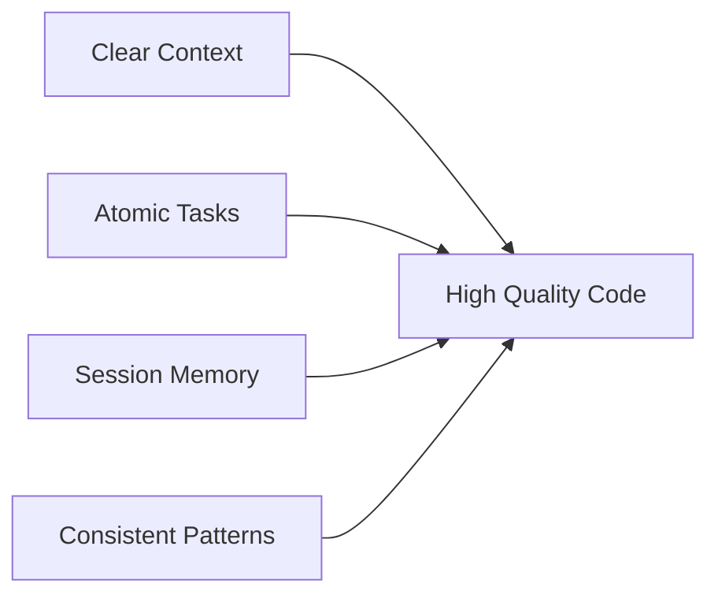

<div align="center">

# 🎸 Vibe Coding Documentation System

[](.)
[](.)
[](LICENSE)

**A structured approach to AI-assisted software development**

*Maximize the effectiveness of AI coding assistants by providing context, memory, and consistent patterns*

[Why This Structure?](#-why-this-structure) •
[Quick Start](#-quick-start-by-scenario) •
[Directory Guide](#-directory-guide) •
[Best Practices](#-best-practices) •
[Examples](#-example-project) •
[Visit Website](https://www.aiagentskit.com)

</div>

---

## 📖 Table of Contents

- [Why This Structure?](#-why-this-structure)
- [Directory Structure](#-directory-structure)
- [Quick Start by Scenario](#-quick-start-by-scenario)
  - [Scenario A: Building from Scratch](#scenario-a-building-from-scratch)
  - [Scenario B: Adopting for Existing Project](#scenario-b-adopting-for-existing-project)
  - [Scenario C: Adding a New Feature](#scenario-c-adding-a-new-feature)
  - [Scenario D: Fixing a Bug](#scenario-d-fixing-a-bug)
  - [Scenario E: Refactoring Code](#scenario-e-refactoring-code)
  - [Scenario F: Onboarding a New Developer](#scenario-f-onboarding-a-new-developer)
  - [Scenario G: Maintenance Mode](#scenario-g-maintenance-mode)
- [Directory Guide](#-directory-guide)
- [Development Loop](#-the-development-loop)
- [Best Practices](#-best-practices)
- [LLM Prompt Patterns](#-llm-prompt-patterns)
- [Example Project](#-example-project)

---

## 🎯 Why This Structure?

> **TL;DR:** AI coding assistants are powerful, but only when given proper context. This system provides that context.

### The Four Pillars of Effective AI-Assisted Development



| Pillar | What It Provides | Why It Matters |
|--------|------------------|----------------|
| 🎯 **Clear Context** | Vision, goals, and boundaries | AI understands *why* your code exists |
| ⚡ **Atomic Tasks** | Well-defined, scoped work units | Fits within AI context windows |
| 🧠 **Session Memory** | Logs of decisions and implementations | AI remembers past conversations |
| 📐 **Consistent Patterns** | Established conventions | AI generates code that matches your style |

> [!TIP]
> Works with **any** AI coding assistant: Claude, GPT-4, Gemini, Cursor, GitHub Copilot, and more!

---

## 📁 Directory Structure

```plaintext
/docs
├── _templates/          # 📋 BASE TEMPLATES (for LLMs to generate files)
├── 00-context/          # 🎯 WHY and WHAT EXISTS RIGHT NOW
├── 01-product/          # 📦 WHAT the product must do
├── 02-features/         # 🔧 HOW features are designed & built
├── 03-logs/             # 🧠 MEMORY (what most teams miss!)
├── 04-process/          # 🔄 HOW to work with this system
└── README.md            # 📖 You are here
```

<details>
<summary><b>Click to see detailed structure</b></summary>

```plaintext
docs/
├── _templates/
│   ├── README.md
│   ├── 00-context/
│   │   ├── vision_template.md
│   │   ├── assumptions_template.md
│   │   └── system-state_template.md
│   ├── 01-product/
│   │   └── prd_template.md
│   ├── 02-features/
│   │   ├── feature-spec_template.md
│   │   ├── tech-design_template.md
│   │   ├── dev-tasks_template.md
│   │   └── test-plan_template.md
│   └── 03-logs/
│       ├── implementation-log_template.md
│       ├── decisions-log_template.md
│       ├── bug-log_template.md
│       ├── validation-log_template.md
│       └── insights_template.md
├── 00-context/
│   ├── vision.md
│   ├── assumptions.md
│   └── system-state.md
├── 01-product/
│   └── prd.md
├── 02-features/
│   └── {feature-name}/
│       ├── feature-spec.md
│       ├── tech-design.md
│       ├── dev-tasks.md
│       └── test-plan.md
├── 03-logs/
│   ├── implementation-log.md
│   ├── decisions-log.md
│   ├── bug-log.md
│   ├── validation-log.md
│   └── insights.md
└── 04-process/
    ├── dev-workflow.md
    ├── definition-of-done.md
    └── llm-prompts.md
```

</details>

---

## 🚀 Quick Start by Scenario

> [!NOTE]
> Choose the scenario that matches your current situation. Each includes a step-by-step checklist.

### Scenario A: Building from Scratch

<details>
<summary><b>🆕 Starting a brand new application with AI assistance</b></summary>

#### Step 1: Define Your Vision ⏱️ *30 min*

```bash
□ Copy this template to your project root
□ Open 00-context/vision.md
□ Answer these questions:
  ✓ What problem does this solve?
  ✓ Who is the target user?
  ✓ What are the boundaries (what we will NOT build)?
  ✓ How do we measure success?
```

#### Step 2: Write Your PRD ⏱️ *1-2 hours*

```bash
□ Open 01-product/prd.md
□ List your user stories
□ Define acceptance criteria for each
□ Prioritize: P0 (must have), P1 (should have), P2 (nice to have)
```

#### Step 3: Plan Your First Feature ⏱️ *1 hour*

```bash
□ Create folder: 02-features/{{first-feature-name}}/
□ Create feature-spec.md (use template)
□ Create tech-design.md (architecture decisions)
□ Create dev-tasks.md (atomic, LLM-executable tasks)
□ Create test-plan.md (validation criteria)
```

#### Step 4: Start Building

```bash
□ Initialize system-state.md with tech stack
□ Follow daily workflow in 04-process/dev-workflow.md
□ Start with TASK-001 from dev-tasks.md
```

</details>

---

### Scenario B: Adopting for Existing Project

<details>
<summary><b>📦 Adding this documentation system to an existing codebase</b></summary>

#### Step 1: Audit Current State ⏱️ *1-2 hours*

```bash
□ Open 00-context/system-state.md
□ Document:
  ✓ Current tech stack (frameworks, libraries, versions)
  ✓ Existing file/folder structure
  ✓ What features are built
  ✓ Current deployment setup
  ✓ Known issues and technical debt
```

#### Step 2: Reverse-Engineer the Vision ⏱️ *30 min*

```bash
□ Open 00-context/vision.md
□ Based on existing code, document:
  ✓ What the product does
  ✓ Who uses it
  ✓ Core principles (inferred from code patterns)
  ✓ Boundaries (what it doesn't do)
```

#### Step 3: Backfill Key Decisions ⏱️ *1 hour*

```bash
□ Open 03-logs/decisions-log.md
□ Document major past decisions:
  ✓ Why was this framework chosen?
  ✓ Why this database?
  ✓ Why this architecture pattern?
  ✓ Any decisions you wish were different?
```

#### Step 4: Create Feature Documentation

```bash
□ For each major existing feature:
  ✓ Create 02-features/{{feature-name}}/
  ✓ Write feature-spec.md (what it does now)
  ✓ Write tech-design.md (current architecture)
  ✓ Skip dev-tasks.md (already built)
  ✓ Create test-plan.md if tests don't exist
```

#### Step 5: Plan Your Next Enhancement

```bash
□ Create 02-features/{{new-feature-name}}/
□ Follow Scenario C workflow below
```

> [!WARNING]
> Don't try to document everything at once! Start with high-level docs, then add detail as you work on each feature.

</details>

---

### Scenario C: Adding a New Feature

<details>
<summary><b>✨ Planning and building a new feature in an existing project</b></summary>

#### Step 1: Create Feature Folder

```bash
□ Create 02-features/{{feature-name}}/
□ Copy templates from _templates/02-features/
```

#### Step 2: Write Feature Spec ⏱️ *30-60 min*

```bash
□ Open feature-spec.md
□ Define:
  ✓ Purpose: Why this feature?
  ✓ User Intent: What is the user trying to do?
  ✓ Acceptance Criteria: How do we know it's done?
  ✓ Edge Cases: What could go wrong?
  ✓ Out of Scope: What are we NOT building?
```

#### Step 3: Write Technical Design ⏱️ *1-2 hours*

```bash
□ Open tech-design.md
□ Define:
  ✓ Component architecture
  ✓ Data models
  ✓ API changes (if any)
  ✓ Dependencies on existing code
  ✓ Performance considerations
```

#### Step 4: Break Down into Tasks ⏱️ *30 min*

```bash
□ Open dev-tasks.md
□ Create atomic tasks (30-60 min each)
□ Each task must have:
  ✓ Clear title
  ✓ Context files to reference
  ✓ Detailed description
  ✓ Acceptance criteria
```

#### Step 5: Build

```bash
□ Follow 04-process/dev-workflow.md
□ Complete one task at a time
□ Log everything in 03-logs/
```

> [!TIP]
> Small, atomic tasks = better AI assistance. Aim for tasks that take 30-60 minutes each.

</details>

---

### Scenario D: Fixing a Bug

<details>
<summary><b>🐛 Investigating and fixing an issue in the codebase</b></summary>

#### Step 1: Log the Bug

```bash
□ Open 03-logs/bug-log.md
□ Create entry with:
  ✓ Bug ID (BUG-XXX)
  ✓ Description
  ✓ Reproduction steps
  ✓ Expected vs actual behavior
  ✓ Severity (Critical/High/Medium/Low)
```

#### Step 2: Investigate with AI

```markdown
□ Share with AI:
  ✓ Bug description from bug-log.md
  ✓ Relevant code files
  ✓ Error messages/stack traces
  ✓ What you've already tried
□ Ask AI to help identify root cause
```

#### Step 3: Fix and Test

```bash
□ Implement the fix
□ Verify reproduction steps no longer reproduce bug
□ Test for regressions
□ Add a test to prevent regression
```

#### Step 4: Document

```bash
□ Update bug-log.md with:
  ✓ Root cause
  ✓ Fix applied
  ✓ Prevention measures
□ Update implementation-log.md with changes
□ Commit: "fix: [description] (BUG-XXX)"
```

> [!IMPORTANT]
> Always document the **root cause**, not just the symptom. This prevents similar bugs in the future.

</details>

---

### Scenario E: Refactoring Code

<details>
<summary><b>♻️ Improving code quality without changing functionality</b></summary>

#### Step 1: Document Intent

```bash
□ Open 03-logs/decisions-log.md
□ Create ADR entry:
  ✓ What are you refactoring?
  ✓ Why? (tech debt, performance, readability)
  ✓ What's the target state?
```

#### Step 2: Create Refactoring Tasks

```bash
□ Create 02-features/refactor-{{name}}/dev-tasks.md
□ Break into small, safe refactoring steps
□ Each task should:
  ✓ Not change external behavior
  ✓ Be testable independently
  ✓ Be revertible if needed
```

#### Step 3: Execute Safely

```bash
□ Run tests before starting (baseline)
□ Refactor one task at a time
□ Run tests after each task
□ Commit after each passing test
```

#### Step 4: Document Outcomes

```bash
□ Update system-state.md if architecture changed
□ Update tech-design.md if patterns changed
□ Log learnings in 03-logs/insights.md
```

> [!CAUTION]
> Never refactor without tests! If tests don't exist, write them first.

</details>

---

### Scenario F: Onboarding a New Developer

<details>
<summary><b>👋 Getting a new team member up to speed</b></summary>

#### Onboarding Checklist

```bash
□ Day 1: Context
  ✓ Read 00-context/vision.md (15 min)
  ✓ Read 00-context/system-state.md (30 min)
  ✓ Run the application locally
  ✓ Explore the codebase structure

□ Day 1-2: History
  ✓ Read 03-logs/decisions-log.md (understand WHY)
  ✓ Read recent entries in implementation-log.md
  ✓ Review bug-log.md for known issues

□ Day 2: Process
  ✓ Read 04-process/dev-workflow.md
  ✓ Read 04-process/definition-of-done.md
  ✓ Review 04-process/llm-prompts.md

□ Day 2-3: First Task
  ✓ Pick a P2 or good-first-issue task
  ✓ Follow the full workflow
  ✓ Ask questions (they become docs!)
```

> [!TIP]
> New developers should be productive within 2-3 days with this system. If not, improve the docs!

</details>

---

### Scenario G: Maintenance Mode

<details>
<summary><b>🔧 Ongoing upkeep of a stable product</b></summary>

#### Weekly Maintenance Checklist

```bash
□ Review bug-log.md for new issues
□ Check assumptions.md - validated/invalidated?
□ Update system-state.md if dependencies updated
□ Review insights.md - learnings to action?
```

#### Monthly Maintenance Checklist

```bash
□ Dependency updates (security patches)
□ Performance review
□ User feedback review (validation-log.md)
□ Tech debt assessment
□ Documentation freshness check
```

> [!NOTE]
> Regular maintenance prevents documentation rot. Schedule these as recurring tasks!

</details>

---

## 📚 Directory Guide

### `00-context/` - WHY and WHAT EXISTS RIGHT NOW

> 🎯 **Purpose:** Provides foundational context for all development work

| File | Purpose | Update Frequency | Key Audience |
|------|---------|------------------|--------------|
| **`vision.md`** | Product purpose, boundaries, north star | Rarely (major pivots) | Everyone |
| **`assumptions.md`** | Risks, unknowns, and assumptions | Weekly or when validated | PMs, Leads |
| **`system-state.md`** | Current tech stack and deployment | After major changes | Developers, AI |

> [!IMPORTANT]
> **Start every LLM conversation by referencing `vision.md`**

---

### `01-product/` - WHAT the product must do

> 📦 **Purpose:** Single source of truth for requirements

| File | Purpose | Update Frequency | Key Audience |
|------|---------|------------------|--------------|
| **`prd.md`** | Product requirements, user stories | As scope changes | PMs, Developers |

---

### `_templates/` - BASE TEMPLATES FOR LLM USE

> 📋 **Purpose:** Standardized templates for AI assistants to generate consistent documents

All base templates are centralized here for easy reference:

```plaintext
_templates/
├── README.md                    # How to use templates
├── 00-context/
│   ├── vision_template.md
│   ├── assumptions_template.md
│   └── system-state_template.md
├── 01-product/
│   └── prd_template.md
├── 02-features/
│   ├── feature-spec_template.md
│   ├── tech-design_template.md
│   ├── dev-tasks_template.md
│   └── test-plan_template.md
└── 03-logs/
    ├── implementation-log_template.md
    ├── decisions-log_template.md
    ├── bug-log_template.md
    ├── validation-log_template.md
    └── insights_template.md
```

**🤖 LLM Usage:** When asked to create a document, reference the appropriate template from this folder.

---

### `02-features/` - HOW features are designed & built

> 🔧 **Purpose:** Feature-specific planning and implementation details

Create a new folder for each feature:

```plaintext
02-features/
├── expense-entry/           # ✅ Example completed feature
│   ├── feature-spec.md      # What it does
│   ├── tech-design.md       # How it's built
│   ├── dev-tasks.md         # Implementation tasks
│   └── test-plan.md         # Validation criteria
└── {{new-feature}}/         # 🆕 Copy templates for new features
    └── ...
```

---

### `03-logs/` - MEMORY (This is what most teams miss!)

> 🧠 **Purpose:** Provide AI assistants with "memory" across sessions

| File | Purpose | Update Frequency | Why Critical |
|------|---------|------------------|--------------|
| **`implementation-log.md`** | What changed and why | After each session | AI continuity |
| **`decisions-log.md`** | Architectural decisions (ADRs) | When decisions made | Context for future |
| **`bug-log.md`** | Bugs and their fixes | When bugs found/fixed | Pattern recognition |
| **`validation-log.md`** | Post-shipping observations | After releases | Product insights |
| **`insights.md`** | Learnings for future | Ongoing | Team knowledge |

> [!WARNING]
> **Skipping logs = amnesia.** Without them, every AI conversation starts from zero!

---

### `04-process/` - HOW to work with this system

> 🔄 **Purpose:** Define workflows and quality standards

| File | Purpose | When to Use |
|------|---------|-------------|
| **`dev-workflow.md`** | Daily development loop (human + LLM) | Every coding session |
| **`definition-of-done.md`** | Quality gates and checklists | Before marking tasks complete |
| **`llm-prompts.md`** | Copy-paste prompt templates | When working with AI |

---

## 🔄 The Development Loop

```plaintext
┌───────────────────────────────────────────────────────────────┐
│                     DAILY DEV LOOP                            │
├───────────────────────────────────────────────────────────────┤
│                                                               │
│  1️⃣  CONTEXT LOAD                                             │
│      └─ Share vision.md + relevant feature docs with LLM     │
│                                                               │
│  2️⃣  TASK SELECTION                                           │
│      └─ Pick next task from dev-tasks.md                     │
│                                                               │
│  3️⃣  IMPLEMENTATION                                           │
│      └─ Execute task with LLM assistance                     │
│                                                               │
│  4️⃣  VALIDATION                                               │
│      └─ Test against test-plan.md criteria                   │
│                                                               │
│  5️⃣  DOCUMENTATION                                            │
│      └─ Update logs (implementation, decisions, bugs)        │
│                                                               │
│  6️⃣  COMMIT                                                   │
│      └─ Clear commit message referencing task                │
│                                                               │
└───────────────────────────────────────────────────────────────┘
```

<details>
<summary><b>Click to see the loop in detail</b></summary>

### 1️⃣ Context Load

**What:** Provide AI with necessary background

```markdown
Share these files:
- 00-context/vision.md (always)
- Relevant feature-spec.md
- Relevant tech-design.md
- Recent implementation-log.md entries
```

### 2️⃣ Task Selection

**What:** Choose an atomic, well-defined task

```markdown
Good task criteria:
✅ Takes 30-60 minutes
✅ Has clear acceptance criteria
✅ References specific files
✅ Is independent (low coupling)
```

### 3️⃣ Implementation

**What:** Build the feature with AI assistance

```markdown
Best practices:
- Start with tests (if TDD)
- Implement incrementally
- Ask AI to explain decisions
- Review generated code carefully
```

### 4️⃣ Validation

**What:** Verify the task is complete

```markdown
Check against:
✅ Acceptance criteria in dev-tasks.md
✅ Test plan in test-plan.md
✅ Definition of done in 04-process/
```

### 5️⃣ Documentation

**What:** Update logs for future sessions

```markdown
Update:
- implementation-log.md (what changed)
- decisions-log.md (if architectural choice made)
- bug-log.md (if bug discovered)
```

### 6️⃣ Commit

**What:** Save work with clear message

```markdown
Format: type(scope): description (TASK-XXX)

Examples:
- feat(auth): add login form (TASK-012)
- fix(api): handle null user (BUG-005)
- refactor(db): extract query logic (TASK-034)
```

</details>

---

## 💡 Best Practices

### ✅ DO

| Practice | Why | Example |
|----------|-----|---------|
| **Keep vision.md concise** | Under 500 words - it's an anchor, not a novel | ✅ "Build a budgeting app for freelancers" |
| **Make tasks atomic** | Each task should be completable in one LLM session | ✅ "Implement login form validation" |
| **Log everything** | The logs ARE your project's memory | ✅ Update implementation-log.md after each session |
| **Reference docs in prompts** | Give AI context it needs | ✅ "Based on vision.md and tech-design.md..." |
| **Update system-state.md** | Keep it current so LLM knows what exists | ✅ Document new dependencies immediately |

---

### ❌ DON'T

| Anti-Pattern | Problem | Instead |
|--------------|---------|---------|
| **Skip the logs** | Every conversation starts from zero | ❌ Log decisions and implementations |
| **Write vague tasks** | "Make it work" isn't actionable | ❌ Be specific: "Add email validation to signup" |
| **Let docs go stale** | Outdated docs → confused LLM → bad code | ❌  Update docs when code changes |
| **Mix features** | Creates coupling and confusion | ❌ One feature folder per capability |

> [!CAUTION]
> Stale docs are worse than no docs! They actively mislead AI assistants.

---

## 🛠️ LLM Prompt Patterns

> **Placeholder Syntax:** `{{file.md}}` means insert content from that file

### Pattern 1: Starting a New Session

```markdown
I'm working on {{PROJECT_NAME}}. Here's the context:

## Vision
{{00-context/vision.md}}

## Current Feature
{{02-features/{{feature-name}}/feature-spec.md}}

## Technical Design
{{02-features/{{feature-name}}/tech-design.md}}

## Current Task
{{02-features/{{feature-name}}/dev-tasks.md → TASK-XXX}}

Please implement this task following the patterns established in the technical design.
```

---

### Pattern 2: Continuing Work

```markdown
Continuing our work on {{PROJECT_NAME}}.

## Recent Implementation
{{03-logs/implementation-log.md → latest 3 entries}}

## Next Task
{{02-features/{{feature-name}}/dev-tasks.md → TASK-XXX}}

Please continue from where we left off.
```

---

### Pattern 3: Debugging a Bug

```markdown
I'm investigating BUG-XXX in {{PROJECT_NAME}}.

## Bug Description
{{03-logs/bug-log.md → BUG-XXX entry}}

## Relevant Code
{{path/to/file.js}}

## Error Message
```
{{error stack trace}}
```

Please help identify the root cause and suggest a fix.
```

---

### Pattern 4: Architectural Decision

```markdown
I need to make an architectural decision for {{PROJECT_NAME}}.

## Context
{{00-context/vision.md}}
{{00-context/system-state.md}}

## Decision Needed
{{describe the decision}}

## Options Considered
1. Option A: ...
2. Option B: ...
3. Option C: ...

Please analyze trade-offs and recommend an approach, considering our tech stack and constraints.
```

<details>
<summary><b>More Prompt Patterns</b></summary>

### Pattern 5: Code Review

```markdown
Please review this code for {{FEATURE_NAME}}.

## Implementation
{{code snippet}}

## Requirements
{{02-features/{{feature-name}}/feature-spec.md → acceptance criteria}}

## Technical Design
{{02-features/{{feature-name}}/tech-design.md}}

Check for:
- Adherence to requirements
- Code quality and patterns
- Edge cases
- Performance issues
```

### Pattern 6: Refactoring

```markdown
I want to refactor {{MODULE_NAME}} in {{PROJECT_NAME}}.

## Current Code
{{existing code}}

## Problems
{{what needs improvement}}

## Technical Design Patterns
{{02-features/{{feature-name}}/tech-design.md → relevant patterns}}

Please suggest a refactoring approach that maintains existing behavior while improving {{quality attribute}}.
```

</details>

---

## 📊 Example Project

> This template includes a complete example for a **Personal Finance Tracker** app.

Review the following files to see how each document type should be filled out:

```plaintext
docs/
├── 00-context/
│   ├── vision.md          ← See example vision
│   ├── assumptions.md     ← See example assumptions
│   └── system-state.md    ← See example tech stack
├── 01-product/
│   └── prd.md             ← See example user stories
├── 02-features/
│   └── expense-entry/     ← Complete feature example
│       ├── feature-spec.md
│       ├── tech-design.md
│       ├── dev-tasks.md
│       └── test-plan.md
└── 03-logs/
    ├── implementation-log.md  ← See example log entries
    ├── decisions-log.md       ← See example ADRs
    └── bug-log.md             ← See example bug tracking
```

> [!TIP]
> Start by reading the example files in order. They build on each other!

---

## 🔗 Quick Reference by Scenario

| I want to... | Start here | Key files |
|--------------|------------|-----------|
| 🆕 Build a new app | [Scenario A](#scenario-a-building-from-scratch) | `vision.md` → `prd.md` → `feature-spec.md` |
| 📦 Document existing project | [Scenario B](#scenario-b-adopting-for-existing-project) | `system-state.md` → `vision.md` → `decisions-log.md` |
| ✨ Add a new feature | [Scenario C](#scenario-c-adding-a-new-feature) | `02-features/{{name}}/` → follow workflow |
| 🐛 Fix a bug | [Scenario D](#scenario-d-fixing-a-bug) | `bug-log.md` → investigate → fix → document |
| ♻️ Refactor code | [Scenario E](#scenario-e-refactoring-code) | `decisions-log.md` → plan → execute → test |
| 👋 Onboard developer | [Scenario F](#scenario-f-onboarding-a-new-developer) | This README → `vision.md` → `dev-workflow.md` |
| 🔧 Maintain project | [Scenario G](#scenario-g-maintenance-mode) | Weekly checklist → monthly checklist |

---

<div align="center">

## 🎸 Happy Vibe Coding!

**Built with ❤️ for AI-assisted development**

📚 [Learn more at AIAgentsKit.com](https://www.aiagentskit.com) | [⬆ Back to Top](#-vibe-coding-documentation-system)

</div>
